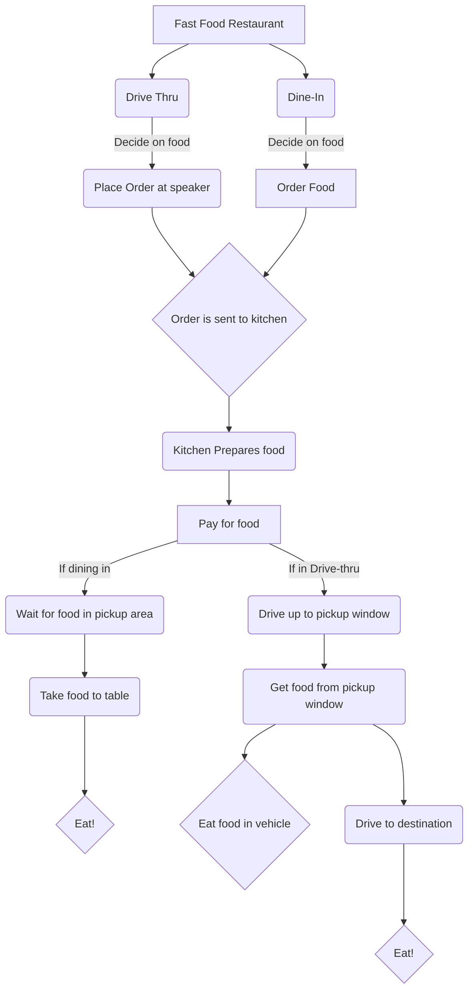

```mermaid
flowchart TD
    A[Fast Food Restaurant] -->B(Dine-In)
    A --> C(Drive Thru)
    B -->|Decide on food| D[Order Food] 
    C -->|Decide on food| F(Place Order at speaker)
    F --> E
    D --> E{Order is sent to kitchen}
    E --> G(Kitchen Prepares food)
    G --> K[Pay for food]
    K -->|If dining in| H(Wait for food in pickup area)
    K -->|If in Drive-thru| I(Drive up to pickup window)
    H --> J(Take food to table)
    J --> L{Eat!}
    I --> M(Get food from pickup window)
    M --> N{Eat food in vehicle}
    M --> O(Drive to destination)
    O --> P{Eat!}
```
